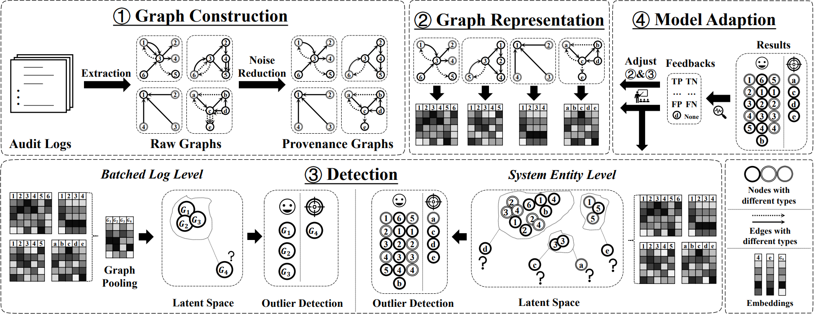

# MAGIC

This is official code for the USENIX Security 24 paper:

**MAGIC: Detecting Advanced Persistent Threats via Masked Graph Representation Learning**



In this paper, we introduce MAGIC, a novel and flexible self-supervised approach for multi-granularity APT detection. MAGIC leverages masked graph representation learning to model benign system entities and behaviors, performing efficient deep feature extraction and structure abstraction on provenance graphs. By ferreting out anomalous system behaviors via outlier detection methods, MAGIC is able to perform both system entity level and batched log level detection. MAGIC is specially designed to handle concept drift with a model adaption mechanism and successfully applies to universal conditions and detection scenarios.

## Dependencies

* Python 3.8
* PyTorch 1.12.1
* DGL 1.0.0
* Scikit-learn 1.2.2

## Datasets

We use two public datasets for evaluation on *batched log level detection*: `StreamSpot` and `Unicorn Wget`.
We use the DARPA Transparent Computing Engagement 3 sub-datasets `E3-Trace`, `E3-THEIA` and `E3-CADETS` for evaluation on *system entity level detection*.
Due to the enormous size of these datasets, we include our **pre-processed** datasets in the `data/` folder. In each sub-directory under the `.data` folder, there is a `.zip` file. You need to **unzip** these `.zip` files into one `graphs.pkl` for each dataset. 

To pre-process these datasets from scratch, do as the follows:

- **StreamSpot Dataset**
  - Download and unzip `all.tar.gz` from [StreamSpot](https://github.com/sbustreamspot/sbustreamspot-data), which includes a single data file `all.tsv`. Copy `all.tsv` to `data/streamspot`.
  - Go to directory `utils` and run `streamspot_parser.py`. This will result in 600 graph data files in the JSON format. 
  - During training and evaluation, function `load_batch_level_dataset` in `utils/loaddata.py` will automatically read and label these graphs and store them into the compressed data archive `graphs.pkl` for efficient data loading.
- **Unicorn Wget Dataset**
  - Download and unzip `attack_baseline.tar.gz` and `benign.tar.gz` from [Wget](https://dataverse.harvard.edu/dataset.xhtml?persistentId=doi:10.7910/DVN/IA8UOS). Copy all `.log` files into `data/wget/raw/`. Ignore contents in `base` and `stream`.
  - Go to directory `utils` and run `wget_parser.py`. This will result in 150 graph data files in the JSON format.
  - During training and evaluation, function `load_batch_level_dataset` in `utils/loaddata.py` will automatically read and label these graphs and store them into the compressed data archive `graphs.pkl` for efficient data loading.
- **DARPA TC E3 Sub-datasets**
  - Go to [DAPRA TC Engagement 3 data release](https://github.com/darpa-i2o/Transparent-Computing).
  - Download and unzip `ta1-trace-e3-official-1.json.tar.gz` into `data/trace/`.
  - Download and unzip `ta1-theia-e3-official-6r.json.tar.gz` into `data/theia/`.
  - Download and unzip `ta1-cadets-e3-official-2.json.tar.gz` and `ta1-cadets-e3-official.json.tar.gz` into `data/cadets/`.
  - **Do not delete log files that are not directly used for training and test purpose (e.g. ta1-theia-e3-official-6r.4-7.json). These files provide entity definitions for subsequent event records, including definitions for malicious entities.**
  - Go to directory `utils` and run `trace_parser.py` with argument `--dataset`. Valid choices are `trace`, `theia`, and `cadets`.
  - MAGIC is evaluated on the DARPA TC datasets using the ThreaTrace label. Go to [ThreaTrace](https://github.com/threaTrace-detector/threaTrace), download the .txt groundtruth files from the folder "groundtruth" and put them into the corresponding dataset folder of MAGIC. For example, `theia.txt` into `data/theia/theia.txt`. 

Meanwhile, we elaborated an alternative labeling methodology on the DARPA TC datasets in our paper(Appendix G). We also provided the corresponding ground truth labels in the same appendix section for sub-datasets E3-Trace, E3-THEIA and E3-CADETS.


## Run

This is a guildline on reproducing MAGIC's evaluations. There are three options: **Quick Evaluation**, **Standard Evaluation** and **Training from Scratch**.

### Quick Evaluation

Make sure you have MAGIC's parameters saved in `checkpoints/` and KNN distances saved in `eval_result/`. Then execute `eval.py` and assign the evaluation dataset using the following command:
```
  python eval.py --dataset *your_dataset*
```
### Standard Evaluation

Standard evaluation trains the detection module from scratch, so the KNN distances saved in `eval_result/` need to be removed. MAGIC's parameters in `checkpoints/` are still needed. Execute `eval.py` with the same command to run standard evaluation:
```
  python eval.py --dataset *your_dataset*
```
### Training from Scratch

Namely, everything, including MAGIC's graph representation module and its detection module, are going to be trained from raw data. Remove model parameters from `checkpoints/` and saved KNN distances from `eval_result/` and execute `train.py` to train the graph representation module. 
```
  python train.py --dataset *your_dataset*
```
Then execute `eval.py` the same as in standard evaluation:
```
  python eval.py --dataset *your_dataset*
```
For more running options, please refer to `utils/config.py`


## Cite 
 
If you make advantage of MAGIC in your research, please cite the following in your manuscript:

```
@inproceedings{jia2024magic,
  title        = {MAGIC: Detecting Advanced Persistent Threats via Masked Graph Representation Learning},
  author       = {Zian Jia and
                  Yun Xiong and
                  Yuhong Nan and
                  Yao Zhang and
                  Jinjing Zhao and
                  Mi Wen},
  booktitle    = {33rd USENIX Security Symposium, USENIX Security 2024},
  year         = {2024},
}
```
